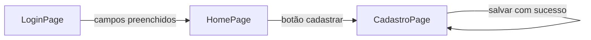

(English version)(README.md)

# Escola App

Aplicativo Flutter desenvolvido como atividade prática da disciplina de **Desenvolvimento de Elementos Visuais, Interface de Usuário e Usabilidade de Aplicação Mobile** — Senac Taboão da Serra.

## Funcionalidades

- Tela de login com validação de campos e feedback via SnackBar
- Tela principal (Home) com acesso ao cadastro
- Tela de cadastro de aluno com validação inline por campo

## Estrutura

```
lib/
├── main.dart
└── pages/
    ├── login_page.dart
    ├── home_page.dart
    └── cadastro_page.dart
```

## Requisitos

- Flutter SDK 3.x
- Dart 3.x
- Android Emulator ou dispositivo físico

## Como rodar

```bash
flutter pub get
flutter run
```

## Fluxo de navegação

