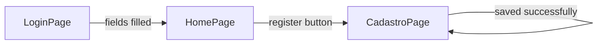

(Versão em Português)(README.pt-BR.md)

# Escola App

Flutter application developed as a hands-on activity for the **Mobile Application Visual Elements, User Interface, and Usability Development** course — Senac Taboão da Serra.

## Features

- Login screen with field validation and SnackBar feedback
- Main screen (Home) with access to registration
- Student registration screen with per-field inline validation

## Structure

```
lib/
├── main.dart
└── pages/
    ├── login_page.dart
    ├── home_page.dart
    └── cadastro_page.dart
```

## Requirements

- Flutter SDK 3.x
- Dart 3.x
- Android Emulator or physical device

## How to run

```bash
flutter pub get
flutter run
```

## Navigation flow

